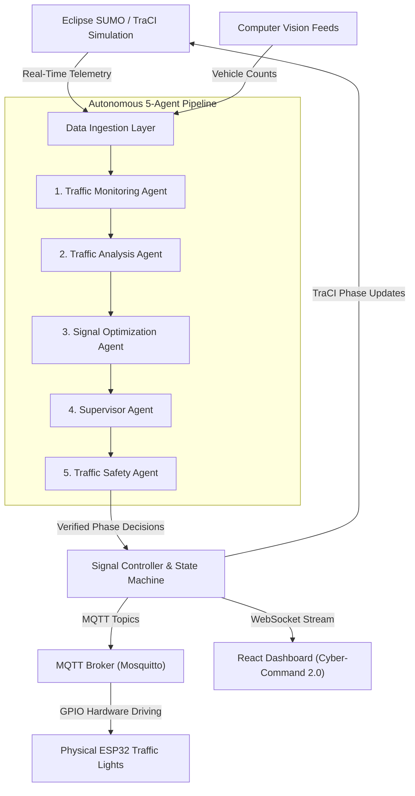

# 🚦 Agentic AI-Driven Multi-Agent System for Intelligent Traffic Management
### *Autonomous Next-Gen Smart City Traffic Signal Control & Cyber-Command 2.0*

[](LICENSE)
[](https://fastapi.tiangolo.com)
[](https://react.dev)
[](https://tailwindcss.com)
[](https://eclipse.dev/sumo/)
[](https://mqtt.org)

> An intelligent, adaptive traffic management system that combines **Agentic AI, Multi-Agent Systems, SUMO traffic simulation, real-time TraCI telemetry, dynamic signal optimization, WebSockets, MQTT, and ESP32-based hardware control**.

---

## 📌 Overview

Urban traffic congestion is a major challenge caused by increasing vehicle density, unpredictable traffic patterns, long waiting times, and inefficient fixed-time traffic signal systems. Traditional traffic signals operate using predefined timings and are unable to dynamically respond to changing traffic conditions.

This project implements an **Agentic AI-Driven Multi-Agent System for Intelligent Traffic Management** that continuously monitors traffic conditions, analyzes congestion patterns, generates adaptive signal timing decisions, validates safety constraints, and communicates the resulting signal commands to an ESP32-based hardware prototype.

The system bridges:
**Traffic Simulation → AI Decision Making → Real-Time Dashboard → IoT Communication → Physical Traffic Signal Prototype**

---

## 🎯 Key Capabilities

- **Real-Time Simulation Telemetry**: Continuously extracts vehicle counts, speeds, queue lengths, and densities via **TraCI** from **Eclipse SUMO**.
- **Collaborative 5-Agent Pipeline**: Decentralized intelligent agents for Monitoring, Analysis, Optimization, Supervisory policy, and Safety clearance gating.
- **Emergency Green Wave Preemption**: 1-Click fast-access override for first responders (Ambulance, Fire Truck, Police) locking green wave corridors.
- **Predictive Horizon Forecasting**: AI forecasts congestion and bottleneck risks at **+15 min**, **+30 min**, and **+60 min** horizons.
- **IoT Hardware Integration**: Bidirectional MQTT communication (`traffic/signals/state`, `traffic/hardware/telemetry`) with physical ESP32 microcontrollers.
- **Cyber-Command 2.0 Web Dashboard**: Immersive operations interface built with React, Vite, Framer Motion, and Tailwind CSS.

---

## 🧠 Multi-Agent AI Architecture



### Agent Roles:
1. **Traffic Monitoring Agent**: Real-time vehicle detection, queue lengths, speeds from TraCI/SUMO and vision sensors.
2. **Traffic Analysis Agent**: Computes approach densities, congestion risk index, and Highway Capacity Manual Level of Service (LOS A–F).
3. **Signal Optimization Agent**: GLIDE dynamic split allocation, platoon extension, and gap-out thresholds.
4. **Supervisor Agent**: Multi-corridor policy arbitration, fairness enforcement, and starvation prevention.
5. **Traffic Safety Agent**: Physical safety gatekeeper ensuring mutual exclusion, yellow clearance (3.0s), all-red clearance (2.0s), and dilemma-zone verification.

---

## 📁 Repository Structure

```
.
├── config/                    # SUMO network configuration & XMLs
├── dataset/                   # Historical and generated traffic datasets
├── networks/                  # SUMO intersection net definitions
├── routes/                    # SUMO traffic demand routes & trips
├── traffic-control-center/
│   ├── backend/
│   │   ├── app/
│   │   │   ├── agents/        # 5-Agent pipeline implementations
│   │   │   ├── api/           # FastAPI REST & WebSocket endpoints
│   │   │   ├── core/          # Pipeline executor, signal controller, config
│   │   │   ├── data_providers/# TraCI/SUMO, Camera, and Synthetic providers
│   │   │   ├── models/        # Pydantic schemas and domain models
│   │   │   ├── mqtt/          # MQTT client & ESP32 telemetry bridge
│   │   │   ├── tests/         # Automated pytest suite
│   │   │   └── websocket/     # High-speed WebSocket streaming feeds
│   │   └── requirements.txt
│   ├── firmware/              # ESP32 Arduino/C++ MQTT firmware
│   └── frontend/              # Cyber-Command 2.0 React 18 + Vite dashboard
├── LICENSE
└── README.md
```

---

## 🚀 Quick Start Guide

### Prerequisites
- **Python 3.10+**
- **Node.js 18+** & **npm**
- *(Optional)* **Eclipse SUMO 1.18+**

### 1. Backend Setup
```bash
cd traffic-control-center/backend
python -m venv .venv

# Windows PowerShell:
.venv\Scripts\Activate.ps1
# Linux/macOS:
# source .venv/bin/activate

pip install -r requirements.txt
uvicorn app.main:app --host 0.0.0.0 --port 8000 --reload
```
API Documentation will be available at `http://localhost:8000/docs`.

### 2. Frontend Setup
```bash
cd traffic-control-center/frontend
npm install
npm run dev
```
Open your browser at `http://localhost:3000` to view the Cyber-Command dashboard.

### 3. Run Automated Tests
```bash
cd traffic-control-center/backend
pytest app/tests -v
```

---

## 🔒 Safety Guarantees

The **Safety Guardian Agent** mathematically enforces physical constraints prior to any signal state change:
- **Mutual Exclusion**: Conflicting directions (e.g. North-South and East-West) can never have simultaneous green signals.
- **Minimum Clearance Intervals**: Mandatory 3.0s Yellow and 2.0s All-Red transitions are guaranteed even during manual operator overrides.
- **Fail-Safe Fallback**: If agent pipeline latency exceeds 200ms or connection drops, intersection falls back to fixed-cycle fail-safe.

---

## 📄 License
This project is open-source and available under the [MIT License](LICENSE).
